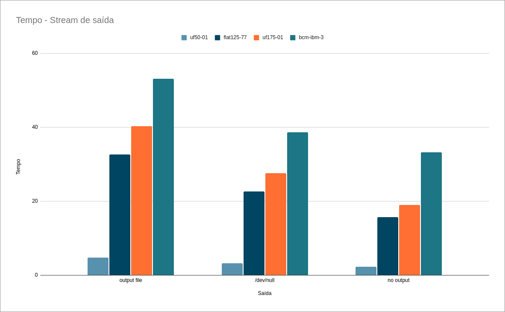

# Somativa - PSPD

| Aluno | Matricula |
| :--: | :--: |
| Eduardo Vieira Lima | 17/0102343 |
| Samuel de Souza Buters Pereira | 17/0114040 |

## Uso
Para compilar a solução, execute:
> make all
> 
Após o comando, a solução paralela e sequencial estarão compiladas nos binários, respectivamente, sequential.bin e parallel.bin  
É possível compilar cada um individualmente com:

> make sequential

> make parallel

Para remover os binários da raíz, execute:

> make clean

## Relatório

### Sistema
##### CPU: AMD Ryzen 5 3600X
    - 6 cores, 12 threads
    - Base clock: 3.8GHz
    - Boost clock: 4.4GHz

##### Mémoria: DDR4 - 16GBytes total
    - Dual channel, 2 x 8GBytes
    - Frequência: 3200mhz cada

##### Armazenamento: SSD M.2
    - Capacidade: 500GBytes
    - Velocidade de leitura: 3500MB/s
    - Velocidade de gravação: 1900MB/s

### Gráficos

Tempo de execução em relação aos arquivos de teste

Tempo de execução em relação aos arquivos de teste com diferente número de threads

Tempo de execução em relação aos arquivos de teste com diferentes métodos de I/O

### Algoritmos
Desenvolvemos dois algoritmos com estratégias diferentes. Um algoritmo para execução sequencial e outro para a execução paralela. A estratégia de cada algoritmo foi escolhida por seu desempenho em cada cenário (sequencial e paralelo).

### Avaliando o algoritmo
#### Gargalo
O maior gargalo acontece na coordenação de threads para imprimir o resultado na ordem correta, apesar de não usarmos semáforos, a lógica para garantir a ordem correta compromete o desempenho.
As operações de I/O  causam grande impacto no desempenho do algoritmo.

### Complexidade
Nosso algoritmo processa todo cláusulas para cada comando de forma paralelizada, assim para para n comandos e m cláusulas a complexidade é O(n*m)
